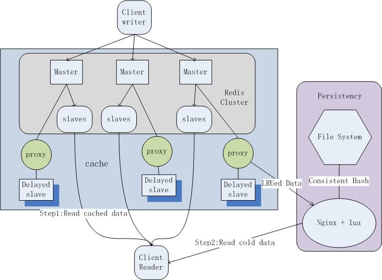

## 描述
* redis作为存储使用时想要保证数据不丢失，需要留有多余内存。一般redis扩容的方式是增加内存，之前redis低版本中vm的方式有一定性能损耗，已经在高版本中丢弃了。但是在有些场景下，存储的数据有冷数据和热数据之分，如果容忍冷数据读取的性能损耗，将冷热数据分别存储不失为一种有效的解决方案。Iceberg是将冷数据持久化到磁盘，并提供访问的扩展redis方案。redis作为存储使用时，在使用过程中一旦超过设定阈值，只能通过指定策略淘汰或丢弃一些数据。iceberg可以保证数据在一定大小的时间窗内是完整不丢失的。这种通过把冷数据磁盘化的方式扩容redis的方案，不仅节约内存成本，防止不必要的浪费，也保证了数据的完整。这种加代理解析协议的方式能有效防止版本绑定。

## 使用说明

* 由于业务方需求，他们存储的数据类型为hash, 暂时只支持hash map lru 数据的存储，被持久化到磁盘的数据通过一致性哈希的方式映射到三级目录中，文件名是key, 文件内容是key 对应的json。
* 为了保证高性能，在redis没有命中时直接到指定路径访问文件， 通过客户端哈希的方式直接指定读取的机器ip和路径，不支持文件系统服务器水平扩容
* 因为解决方案主要是通redis master和slave之间的代理，因此一旦master slave发生failover， 暂时还没有拓扑结构发生变化的检测和切换功能
* 在nginx lua 和c 中涉及到ip地址和文件路径时都是写死的，在hash.c 文件中。以后会修改。
* 暂时保证数据完整并非完全不丢失，在slave重启时，数据加载到内存过程中可能有小时间窗内数据丢失
* 在redis2.8及以上版本测试通过。但是在使用redis cluster 时，由于连接问题导致发生了主从之间failover拓扑结构改变，因此要参照网络和连接情况进行选取。我们在实际使用过程中采取的是redis2.8。
* 无自动冷热数据切换功能，业务方自行读写redis，写入即为热数据知道redis自身算法lru出去
* 每个文件系统存储服务器配置备份数量必须为一，以后会修改

## 效果

* 在实际使用过程中，存储的数据分成两部分，一部分在redis中，一部分在文件系统，整体性能由这两部分决定，前者比重越大，效果越好。我们存储的数据类型为map, 每个map 大小为几K 到几十K，在纯文件存储通过nginx访问的方式，2主2从，没有写只有读时qps可达到6900,平均访问时间2.1ms

## 架构

* 我们为每个master与特定的slave 之间增加一层代理，这些代理负责把master发送给slave的删除命令延时，在延时阶段读取对应slave中被删除key的值，通过nginx  lua写入文件系统，待下次从redis中读取不到数据时，到冷数据部分通过nginx访问文件系统再次读取。除了删除命令，其它所有master与delayed slave 之间的数据proxy都直接转发。Delayed slave 可以同普通slave一样对外提供读服务，但是因为有少许延时操作，在要求数据完全准确的情况下可以不对外提供服务。由于编码主要集中在proxy部分，主要是redis协议的通信，而不用直接修改master和slave源码，防止了该方案对特定版本的绑定。
*被持久化到磁盘的数据通过一致性哈希的方式映射到三级目录中，文件名是key, 文件内容是key 对应的json, 大小几K 到几十K,需要满足几百G数据量级甚至以上的存储，并利用文件系统的特性保证小文件比较高的随机访问速度。整体结构如图所示。

## proxy

* 在redis slave之间转发数据，将删除数据存储到磁盘
* proxy 的依赖
	1.	glib2.0: 在Makefile中指定了路径，可根据实际情况进行修改-I/usr/include/glib-2.0 -I/usr/lib64/glib-2.0/include -lglib-2.0
	2.	Jansson:https://github.com/akheron/jansson
	3.	log4c:http://log4c.sourceforge.net/

## nginx server

* openresty  提供文件读写的服务，提供lru数据的文件系统访问，其中读最终采取了由客户端直接获取就静态文件的方式
* 进入c 目录运行sh run.sh 生成libhash.so文件，放入openresty配置可识别的位置，所需依赖报过nginx.conf全在nginx目录下

## client

在redis 客户端正常访问数据为空时，通过客户端得到http请求的url地址。 client， nginx server 和proxy对于文件系统读写地址配置需要一致

